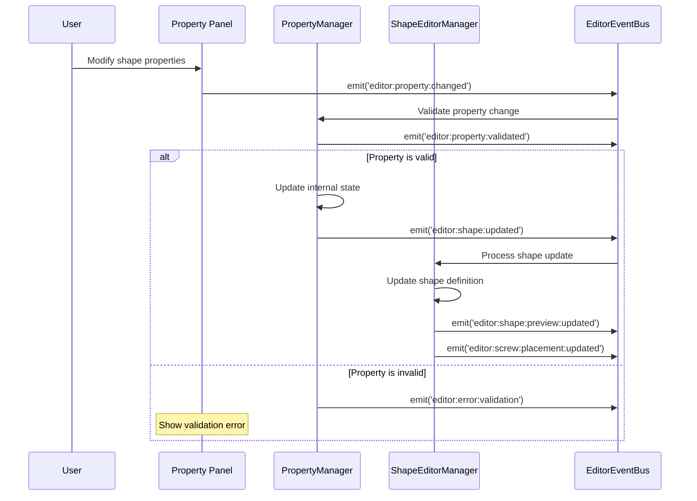
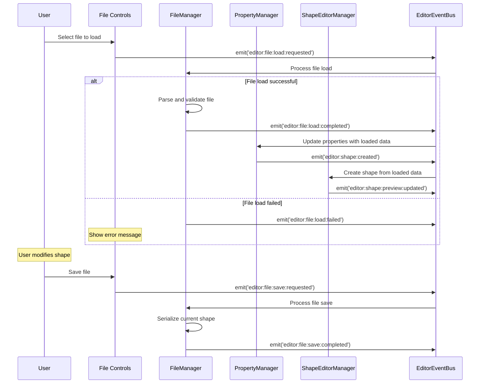
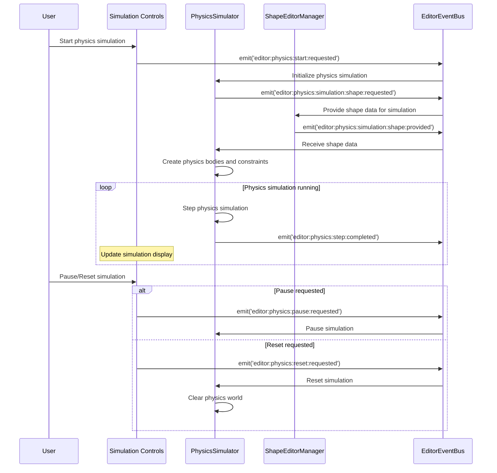
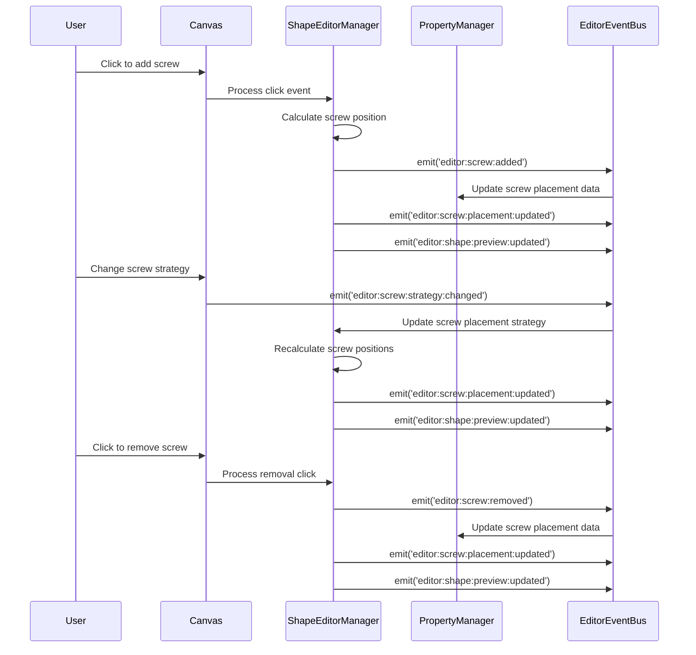

# Editor Event Flows Documentation

## Overview

The editor event system provides a comprehensive, type-safe event-driven architecture for the shape editor component of the 2D physics puzzle game. It extends the shared event foundation with editor-specific functionality for shape creation, property management, and physics simulation.

## Architecture

### Core Components

1. **SharedEventBus** (`src/shared/events/SharedEventBus.ts`)
   - Core event bus with priority handling, loop detection, and performance tracking
   - Shared foundation used by both game and editor systems

2. **EditorEventBus** (`src/editor/core/EditorEventBus.ts`)
   - Singleton extending SharedEventBus with editor-specific configuration
   - Namespace: 'editor'
   - Max history: 1000 events, Loop detection threshold: 50
   - Additional convenience methods for editor usage patterns

3. **EditorEventTypes** (`src/editor/events/EditorEventTypes.ts`)
   - 40+ editor-specific event definitions
   - Comprehensive type safety with payload-based structure
   - All events use `editor:domain:action` naming convention

## Event Categories

### File Management Events
- **Load Operations**: `editor:file:load:requested`, `editor:file:load:completed`, `editor:file:load:failed`
- **Save Operations**: `editor:file:save:requested`, `editor:file:save:completed`
- **Validation**: `editor:file:validation:failed`

### Property Management Events  
- **Value Changes**: `editor:property:changed`, `editor:property:validated`
- **Batch Operations**: `editor:property:random:requested`, `editor:property:reset:requested`

### Shape Management Events
- **Lifecycle**: `editor:shape:created`, `editor:shape:updated`, `editor:shape:destroyed`
- **Selection**: `editor:shape:selected`
- **Preview**: `editor:shape:preview:updated`

### Screw Management Events
- **Placement**: `editor:screw:placement:updated`, `editor:screw:added`, `editor:screw:removed`
- **Strategy**: `editor:screw:strategy:changed`

### Physics Simulation Events
- **Control**: `editor:physics:start:requested`, `editor:physics:pause:requested`, `editor:physics:reset:requested`
- **State**: `editor:physics:step:completed`, `editor:physics:debug:toggled`
- **Data Exchange**: `editor:physics:simulation:shape:requested`, `editor:physics:simulation:shape:provided`

### Drawing Tool Events (Phase 2)
- **Tool Management**: `editor:tool:selected`
- **Drawing Process**: `editor:drawing:started`, `editor:drawing:progress`, `editor:drawing:completed`, `editor:drawing:cancelled`
- **Preview**: `editor:drawing:preview:updated`
- **Mode Changes**: `editor:drawing:mode:changed`, `editor:drawing:state:changed`

### Grid System Events (Phase 2)
- **Toggle**: `editor:grid:toggled`, `editor:grid:snap:toggled`
- **Configuration**: `editor:grid:size:changed`
- **Interactions**: `editor:grid:coordinate:snapped`

### UI State Events
- **Layout**: `editor:panel:toggled`, `editor:canvas:resized`
- **Mode**: `editor:mode:changed`

### Error Events
- **Validation**: `editor:error:validation`
- **Physics**: `editor:error:physics`
- **File Operations**: `editor:error:file`

## Event Emitters and Subscribers Matrix

### Major Event Emitters

| System | Primary Events Emitted |
|--------|------------------------|
| **ShapeEditorManager** | `editor:screw:placement:updated`, `editor:shape:preview:updated`, `editor:physics:simulation:shape:provided`, `editor:error:validation`, `editor:screw:added`, `editor:screw:removed` |
| **FileManager** | `editor:file:load:completed`, `editor:file:load:failed`, `editor:file:save:completed`, `editor:error:file`, `editor:file:validation:failed` |
| **PropertyManager** | `editor:property:validated`, `editor:property:changed` |
| **GridManager** | `editor:grid:coordinate:snapped`, `editor:grid:toggled`, `editor:grid:size:changed`, `editor:grid:snap:toggled` |
| **DrawingToolManager** | Drawing tool events for state management |
| **PhysicsSimulator** | `editor:physics:step:completed`, physics simulation events |

### Major Event Subscribers

| System | Primary Events Subscribed |
|--------|---------------------------|
| **ShapeEditorManager** | `editor:shape:*`, `editor:canvas:resized`, `editor:physics:debug:toggled`, `editor:screw:*`, `editor:physics:*:requested` |
| **FileManager** | `editor:file:load:requested`, `editor:file:save:requested` |
| **PropertyManager** | `editor:shape:*`, `editor:property:changed`, `editor:property:*:requested` |
| **GridManager** | `editor:grid:toggled`, `editor:grid:size:changed`, `editor:grid:snap:toggled` |
| **DrawingStateManager** | Drawing tool events |
| **PhysicsSimulator** | Physics control events |

## Critical Event Flows

### 1. Shape Creation Flow



### 2. File Management Flow



### 3. Physics Simulation Flow



### 4. Grid and Drawing Tool Flow

```mermaid
sequenceDiagram
    participant User
    participant UI as Drawing Tools
    participant DTM as DrawingToolManager
    parameter GM as GridManager
    participant EB as EditorEventBus

    User->>UI: Toggle grid
    UI->>EB: emit('editor:grid:toggled')
    EB->>GM: Toggle grid visibility
    GM->>EB: emit('editor:grid:toggled') [confirmation]
    
    User->>UI: Select drawing tool
    UI->>EB: emit('editor:tool:selected')
    EB->>DTM: Activate selected tool
    
    User->>UI: Start drawing
    UI->>EB: emit('editor:drawing:started')
    EB->>DTM: Begin drawing operation
    
    loop Drawing in progress
        User->>UI: Move mouse/draw
        UI->>EB: emit('editor:drawing:progress')
        EB->>DTM: Update drawing state
        DTM->>EB: emit('editor:drawing:preview:updated')
        
        alt Grid snap enabled
            DTM->>GM: Request coordinate snap
            GM->>EB: emit('editor:grid:coordinate:snapped')
        end
    end
    
    User->>UI: Complete drawing
    UI->>EB: emit('editor:drawing:completed')
    EB->>DTM: Finalize drawing
    DTM->>EB: emit('editor:shape:created')
```

### 5. Screw Placement Management Flow



## Event Naming Conventions

### Established Patterns

1. **Consistent Structure**: All editor events use `editor:domain:action` format
   -  `editor:shape:created`, `editor:file:load:completed`
   -  `editor:physics:start:requested`, `editor:grid:toggled`

2. **Payload-Based Design**: All events include structured payload objects
   -  Consistent payload structure across all events
   -  Type-safe payload definitions

3. **Action Naming**: Clear, descriptive action names
   -  `requested` for user-initiated actions
   -  `completed` for successful operations  
   -  `failed` for error conditions

4. **Domain Separation**: Clear separation by functional domain
   -  `file:`, `shape:`, `physics:`, `property:`, `grid:`, `tool:`

### Event Naming Strengths

 **Highly Consistent**: All events follow the same naming pattern
 **Self-Documenting**: Event names clearly indicate purpose and domain
 **Type-Safe**: Strong TypeScript integration with payload types
 **Hierarchical**: Logical grouping by domain and action

## Performance Considerations

### Event Frequency Patterns

#### High-Frequency Events
- `editor:physics:step:completed` - During physics simulation (60fps)
- `editor:drawing:progress` - During active drawing operations
- `editor:grid:coordinate:snapped` - During grid-snapped drawing

#### Medium-Frequency Events
- `editor:property:changed` - During property editing
- `editor:shape:preview:updated` - During shape modifications
- `editor:screw:placement:updated` - During screw adjustments

#### Low-Frequency Events
- `editor:file:*` - File operations (user-initiated)
- `editor:mode:changed` - Mode switches (user-initiated)
- `editor:tool:selected` - Tool changes (user-initiated)

### Optimization Strategies

1. **Event Batching**: Property changes could be batched for better performance
2. **Debouncing**: Preview updates use debouncing to reduce frequency
3. **Conditional Emission**: Events only emitted when actual changes occur
4. **Efficient Payloads**: Minimal payload data to reduce memory usage

## Error Handling Patterns

### Error Event Categories

1. **Validation Errors** (`editor:error:validation`)
   - Shape property validation failures
   - File format validation errors
   - User input validation issues

2. **Physics Errors** (`editor:error:physics`)
   - Physics simulation failures
   - Shape creation errors for physics
   - Constraint creation problems

3. **File Errors** (`editor:error:file`)
   - File load/save failures
   - File format errors
   - File system access issues

### Error Recovery Strategies

- **Graceful Degradation**: Continue operation with reduced functionality
- **User Feedback**: Clear error messages through error events
- **State Preservation**: Maintain editor state despite errors
- **Retry Mechanisms**: Automatic retry for transient failures

## Debugging and Monitoring

### Debug Capabilities

1. **Event History**: Complete event trail for debugging
2. **Performance Tracking**: Event processing time monitoring
3. **State Inspection**: Current editor state accessible via events
4. **Physics Debug**: Special debug mode for physics simulation

### Debug Event Usage

- `editor:physics:debug:toggled` - Enable/disable physics debug visualization
- Event bus statistics available through inherited SharedEventBus methods
- Comprehensive event logging with timestamps and source tracking

## Integration with Shared Events

### Shared Event Usage

The editor system leverages shared events for:

- **Physics Operations**: Common physics events for body/constraint management
- **File Operations**: Base file operation events extended with editor-specific payloads
- **Validation**: Shared validation event patterns with editor context
- **Error Handling**: Common error event structure with editor-specific details

### Event Bus Coordination

- Editor events are namespaced to prevent conflicts with game events
- Shared event utilities (debouncing, batching, filtering) available
- Performance monitoring shared between game and editor systems

## Best Practices

### Development Guidelines

1. **Consistent Naming**: Always use `editor:domain:action` format
2. **Payload Structure**: Include all relevant data in structured payloads
3. **Type Safety**: Define specific TypeScript interfaces for all events
4. **Error Events**: Always emit error events for failure conditions
5. **State Updates**: Use events for all state changes to maintain consistency
6. **Performance**: Consider event frequency impact on performance

### Testing Strategies

1. **Event Mocking**: Mock event bus for unit testing
2. **Flow Testing**: Test complete event flows end-to-end
3. **Error Testing**: Verify error event emission and handling
4. **Performance Testing**: Monitor event processing performance

## Future Enhancements

### Planned Improvements

1. **Event Replay**: Add event replay capability for debugging
2. **Undo/Redo**: Implement undo/redo using event history
3. **Event Validation**: Add runtime event validation
4. **Performance Optimization**: Implement intelligent event batching
5. **Advanced Grid**: Enhanced grid system with multiple snap modes
6. **Collaborative Editing**: Multi-user event synchronization

### Extensibility

The editor event system is designed for easy extension:

- New drawing tools can add domain-specific events
- Additional property types integrate seamlessly
- Physics simulation can be extended with new event types
- File format support expandable through existing event patterns