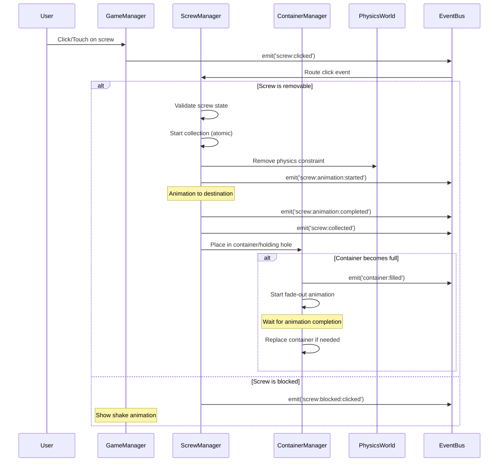
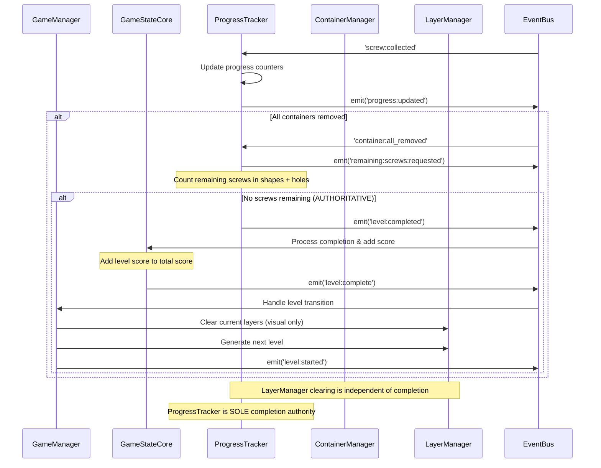
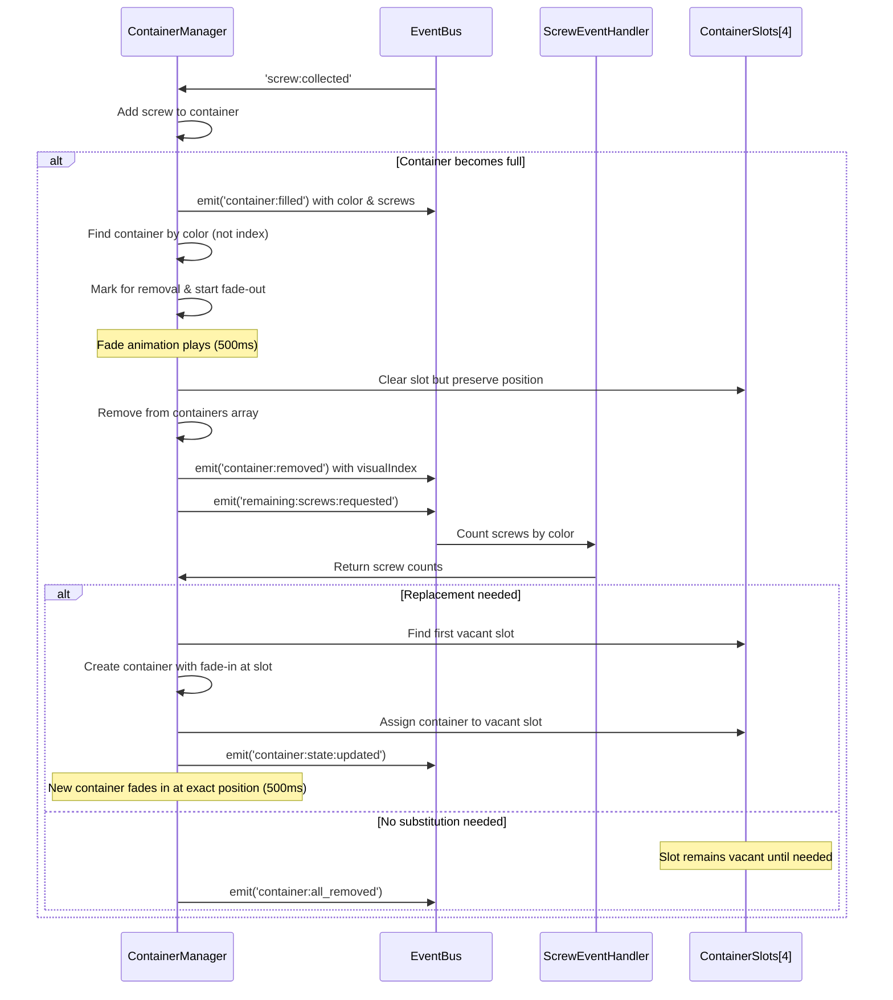

# Game Architecture Documentation

## Documentation Guidelines

**Note**: This document is a companion to the `game_event_flows.md` document, which details the event-driven architecture of the game. This document focuses on the overall game architecture, system organization, and logic flows.

**Maintenance**: This document describes the current state of the game architecture. New functionality is documented directly in relevant sections rather than as separate updates.

## Overview

PAR Shape 2D is a physics-based puzzle game using Next.js, TypeScript, and Matter.js. The game features a sophisticated event-driven architecture with complete system decoupling, comprehensive shared utilities, and robust physics integration.

### Core Game Concept

Players remove screws from layered shapes to collect them in color-matched containers. Each level presents multiple layers of shapes with screws that must be strategically removed to allow shapes to fall and progress through the level.

### Key Features

- **Physics-Based Gameplay**: Real-time physics simulation using Matter.js
- **Layered Shape System**: Multiple layers with depth-based collision detection
- **Strategic Screw Removal**: Screws hold shapes in place and must be removed strategically
- **Color-Matching Mechanics**: Screws must be placed in matching colored containers
- **Progressive Difficulty**: Increasing complexity through additional layers and shapes
- **Touch/Mouse Support**: Full cross-platform input handling with adaptive touch radius (30px mobile, 15px desktop)

## Architectural Principles

### 1. Event-Driven Architecture

The entire game operates on a comprehensive event system that ensures complete decoupling between systems:

- **Centralized Event Bus**: `SharedEventBus` handles all inter-system communication
- **Type-Safe Events**: 120+ game-specific event types with full TypeScript support
- **Priority-Based Processing**: Events can be prioritized for critical operations
- **Loop Detection**: Sophisticated protection against infinite event loops
- **Performance Monitoring**: Built-in event processing metrics and debugging

### 2. System Decoupling

All game systems extend `BaseSystem` and operate independently:

- **Autonomous Operation**: Each system manages its own state and responsibilities
- **Event-Only Communication**: No direct system-to-system dependencies
- **Graceful Degradation**: Systems can fail without affecting others
- **Hot-Swappable**: Systems can be replaced or modified independently

### 3. Shared Utilities Framework

Comprehensive utilities prevent code duplication and ensure consistency:

- **EventEmissionUtils**: Standard event creation with automatic timestamps and completion patterns
- **StateValidationUtils**: Unified validation with system, game state, and screw validation helpers  
- **DebugLogger**: Consistent debug logging with conditional output, standardized formatting, and emojis
- **Enhanced Animation System**:
  - **EasingFunctions**: 24+ professional easing functions (cubic, elastic, bounce, etc.)
  - **AnimationUtils**: State management with transition support for evolving animation APIs
  - **EasingPresets**: Curated configurations for UI, game, and physics animations
  - **Screw Rotation**: Configurable rotation speeds for collection (1 rps) and transfer (1.5 rps) animations
  - **Blocked Screw Feedback**: 300ms shake animation with alternating horizontal/vertical oscillations
- **Advanced Rendering Utilities**:
  - **GeometryRenderer**: Sophisticated shape rendering with rounded corners and effects
  - **ButtonStyles**: Professional UI styling system with accessibility features
  - **ScrewRenderer**: Enhanced screw visualization with visible rotation, clean 4-point cross, and rim notch indicators
- **GeometryUtils**: Mathematical calculations and collision detection
- **CollisionUtils**: Advanced two-phase collision detection with configurable screw blocking margins (0px default)

### 4. Physics Integration

Deep integration with Matter.js physics engine:

- **Shared Physics World**: Centralized physics simulation
- **Body Management**: Automatic physics body lifecycle management
- **Constraint System**: Dynamic constraint management and lifecycle control
- **Collision Detection**: Advanced two-phase collision handling (broad + narrow phase) with layer isolation and configurable blocking margins

## System Architecture

### System Relationships Overview

The following diagram illustrates the relationships and dependencies between all game systems:

```mermaid
graph TB
    %% Core Management Layer
    GameManager[GameManager<br/>Game Lifecycle & Coordination]
    GameStateCore[GameStateCore<br/>State Management & Scoring]
    
    %% Event System (Central Hub)
    EventBus((SharedEventBus<br/>Event Coordination))
    
    %% Core Game Systems
    ScrewManager[ScrewManager<br/>Screw Lifecycle & Physics]
    ContainerManager[ContainerManager<br/>Container & Collection Logic]
    LayerManager[LayerManager<br/>Shape & Layer Organization]
    PhysicsWorld[PhysicsWorld<br/>Matter.js Integration]
    
    %% Supporting Systems
    HoldingHoleManager[HoldingHoleManager<br/>Overflow Storage]
    ProgressTracker[ProgressTracker<br/>Progress & Win Conditions]
    SaveLoadManager[SaveLoadManager<br/>State Persistence]
    GameRenderManager[GameRenderManager<br/>Visual Presentation]
    
    %% Screw Subsystems
    ScrewEventHandler[ScrewEventHandler<br/>Event Processing]
    ScrewAnimationService[ScrewAnimationService<br/>Animation Management]
    ScrewTransferService[ScrewTransferService<br/>Transfer Logic]
    ScrewPhysicsService[ScrewPhysicsService<br/>Physics Integration]
    ScrewPlacementService[ScrewPlacementService<br/>Strategic Placement]
    
    %% Shared Utilities
    SharedUtils[Shared Utilities<br/>EventEmissionUtils<br/>StateValidationUtils<br/>DebugLogger<br/>GeometryRenderer<br/>AnimationUtils]
    
    %% Relationships - Core Management
    GameManager -.-> EventBus
    GameStateCore -.-> EventBus
    
    %% Relationships - Core Systems to Event Bus
    ScrewManager -.-> EventBus
    ContainerManager -.-> EventBus
    LayerManager -.-> EventBus
    PhysicsWorld -.-> EventBus
    
    %% Relationships - Supporting Systems to Event Bus
    HoldingHoleManager -.-> EventBus
    ProgressTracker -.-> EventBus
    SaveLoadManager -.-> EventBus
    GameRenderManager -.-> EventBus
    
    %% Screw System Internal Structure
    ScrewManager --> ScrewEventHandler
    ScrewManager --> ScrewAnimationService
    ScrewManager --> ScrewTransferService
    ScrewManager --> ScrewPhysicsService
    ScrewManager --> ScrewPlacementService
    
    %% Screw Subsystems to Event Bus
    ScrewEventHandler -.-> EventBus
    ScrewAnimationService -.-> EventBus
    ScrewTransferService -.-> EventBus
    ScrewPhysicsService -.-> EventBus
    
    %% Physics Integration
    ScrewPhysicsService --> PhysicsWorld
    LayerManager --> PhysicsWorld
    
    %% Shared Utilities Usage (all systems use these)
    GameManager --> SharedUtils
    GameStateCore --> SharedUtils
    ScrewManager --> SharedUtils
    ContainerManager --> SharedUtils
    LayerManager --> SharedUtils
    PhysicsWorld --> SharedUtils
    HoldingHoleManager --> SharedUtils
    ProgressTracker --> SharedUtils
    SaveLoadManager --> SharedUtils
    GameRenderManager --> SharedUtils
    
    %% Key Data Flows
    EventBus -.->|screw:clicked| ScrewManager
    EventBus -.->|screw:collected| ContainerManager
    EventBus -.->|screw:collected| ProgressTracker
    EventBus -.->|container:filled| GameStateCore
    EventBus -.->|level:completed| GameManager
    EventBus -.->|remaining:screws:requested| ScrewEventHandler
    
    %% Styling
    classDef coreSystem fill:#e1f5fe,stroke:#01579b,stroke-width:2px
    classDef supportSystem fill:#f3e5f5,stroke:#4a148c,stroke-width:2px
    classDef screwSubsystem fill:#fff3e0,stroke:#e65100,stroke-width:2px
    classDef eventSystem fill:#e8f5e8,stroke:#1b5e20,stroke-width:3px
    classDef sharedSystem fill:#fce4ec,stroke:#880e4f,stroke-width:2px
    
    class GameManager,GameStateCore,ScrewManager,ContainerManager,LayerManager,PhysicsWorld coreSystem
    class HoldingHoleManager,ProgressTracker,SaveLoadManager,GameRenderManager supportSystem
    class ScrewEventHandler,ScrewAnimationService,ScrewTransferService,ScrewPhysicsService,ScrewPlacementService screwSubsystem
    class EventBus eventSystem
    class SharedUtils sharedSystem
```

**Legend:**
- **Blue (Core Systems)**: Primary game logic systems
- **Purple (Supporting Systems)**: Specialized functionality systems  
- **Orange (Screw Subsystems)**: Components within ScrewManager
- **Green (Event System)**: Central communication hub
- **Pink (Shared Utilities)**: Common functionality used by all systems
- **Solid Lines**: Direct dependencies/composition
- **Dotted Lines**: Event-based communication

### Core Systems

#### **GameManager** (`src/game/core/GameManager.ts`)
**Responsibility**: Overall game lifecycle and coordination
- Game state transitions (start, pause, resume, stop)
- Level progression management
- System initialization and cleanup
- Input event routing (mouse/touch)
- Save/restore game state

**Key Events Emitted**:
- `game:started`, `game:paused`, `game:resumed`, `game:over`
- `level:started`, `level:complete`

#### **GameStateCore** (`src/game/core/GameStateCore.ts`)
**Responsibility**: Central game state management
- Current level tracking
- Score management (level and total scores)
- Game progress monitoring
- Win/lose condition evaluation
- State persistence coordination

**Key Events Handled**:
- `screw:collected` - Updates progress and scores
- `container:filled` - Tracks container completion
- `level:completed` - Handles level completion logic

#### **ScrewManager** (`src/game/systems/ScrewManager.ts`)
**Responsibility**: Complete screw lifecycle management with ownership tracking
- Screw instantiation and placement within shapes
- Click/touch event handling for screw selection
- Collection animation management
- Physics constraint management
- Transfer coordination to containers/holding holes
- **Ownership system** ensuring data integrity and preventing race conditions

**Key Components**:
- **ScrewEventHandler**: Event processing and routing with ownership validation
- **ScrewAnimationService**: Collection animation management
- **ScrewTransferService**: Destination finding, transfer logic, and ownership transfers
- **ScrewPhysicsService**: Physics constraint management
- **ScrewPlacementService**: Strategic screw placement within shapes

**Ownership System**:
- **Single Owner Principle**: Each screw has exactly one owner (`shape`, `container`, `holding_hole`)
- **Immediate Transfer**: Ownership changes when operations begin, not when animations complete
- **Deletion Protection**: Only current owner can delete/destroy screws
- **Clean Disposal**: Shapes only dispose screws they still own

**Key Events**:
- `screw:clicked` → `screw:removed` → `screw:collected`
- `screw:animation:started` → `screw:animation:completed`
- `screw:transfer:started` → `screw:transfer:completed` (with ownership transfer)

#### **ContainerManager** (`src/game/core/managers/ContainerManager.ts`)
**Responsibility**: Container lifecycle and screw assignment with fixed-slot positioning
- Container instantiation with appropriate colors and hole counts (1-3 holes per container)
- **Hole Planning**: Sizes containers based on ALL remaining screws of each color (visible or not), but only creates containers for colors present in visible shapes or holding holes
- Screw placement and hole management
- Container completion detection
- Intelligent container substitution with fade animations
- Fixed 4-slot positioning system

**Key Features**:
- **Fixed-Slot System**: 4 predetermined positions prevent container shifting
- **Smart Replacement**: Uses real-time screw data for optimal container selection
- **Vacant Slot Usage**: New containers appear in first available slot
- **Color-Based Identification**: Finds containers by color instead of index for reliability
- **Race Condition Prevention**: Event-driven substitution with immediate fade-in
- **Reservation System**: Prevents duplicate screw assignments

**Slot Architecture**:
- `containerSlots[]` maintains 4 fixed positions
- `getContainers()` returns slot-ordered containers
- Positioning calculated for all slots, not just filled ones
- Container removal preserves slot positions

**Container Replacement Timing**:
1. Container filled → Mark for removal → Start fade-out animation (500ms)
2. After fade-out completes → Remove container physically  
3. **IMMEDIATELY** spawn replacement containers with fade-in animation (500ms)
4. Replacement containers become fully visible

**Proactive Container Management**:
- **ContainerPlanner** utility for optimal container calculation
- **Color Selection**: Only creates containers for colors present in visible shapes or holding holes
- **Hole Sizing**: Counts ALL remaining screws (regardless of visibility) for proper hole count planning
- Event-driven updates on layer changes
- Throttled updates (1-second) to prevent excessive recalculation
- Conservative updates that only add missing containers

#### **LayerManager** (`src/game/systems/LayerManager.ts`)
**Responsibility**: Multi-layer shape organization and visual management
- Layer instantiation and management (10+ layers per level, with only 4 visible at a time)
- Shape placement within layers using **ShapeFactory** for robust shape generation
- Layer visibility and depth management
- Physics group isolation between layers
- Progressive layer revelation
- **Layer state notifications**: Emits layer clearing events for UI updates
- **Note**: Does NOT determine level completion - only handles layer management

**Layer Properties**:
- Each layer has unique visual tinting
- Physics bodies only interact within their layer
- 6 shapes per layer with strategic placement including capsule shapes
- Depth-based collision detection for screw accessibility
- **ShapeFactory Integration**: Uses advanced shape generation with fallback mechanisms for reliable shape placement
- **Screw Colors**: Screws are randomly colored using one of 9 colors: pink, red, green, blue, light blue, yellow, purple, orange, or brown
- **Shape Types**: Supports 12 shape types: circle, capsule, arrow, chevron, star, triangle, square, rectangle, pentagon, hexagon, heptagon, octagon, horseshoe (currently disabled)

#### **PhysicsWorld** (`src/game/physics/PhysicsWorld.ts`)
**Responsibility**: Physics engine integration and management
- Matter.js world management with composite body support
- Body and constraint lifecycle including complex multi-part shapes
- Collision event processing
- Physics debugging and visualization
- Performance optimization

**Integration Points**:
- Shape body instantiation and management including composite shapes (capsules)
- Screw constraint handling
- Layer-based collision groups
- Real-time physics stepping
- **Composite Body Support**: Proper handling of multi-part physics bodies with accurate bounds calculation

**Physics State Management**:
- Proper handling of screw states: `isBeingCollected`, `isInContainer`, `isCollected`
- Atomic screw collection prevents duplicate clicks and race conditions
- Updated constraint stiffness for natural movement
- Optimized constraint removal for immediate shape falling

**Race Condition Prevention**:
- Physics constraints removed atomically with state changes
- State validation prevents duplicate operations
- Proper screw filtering logic excludes `isInContainer` screws

### Supporting Systems

#### **HoldingHoleManager** (`src/game/core/managers/HoldingHoleManager.ts`)
**Responsibility**: Overflow screw storage
- 5-hole holding area management
- Screw transfer to new containers
- Full-hole timeout management (5-second rule)
- Visual feedback for available/occupied holes

#### **ProgressTracker** (`src/game/systems/ProgressTracker.ts`)
**Responsibility**: **Authoritative game progress tracking and level completion**
- Real-time progress percentage calculation
- Screw counting across shapes and holding holes
- **Single source of truth for level completion detection**
- Progress bar updates
- **Score integration**: Triggers score addition to total when level completes
- **Win condition evaluation**: Determines when all game objectives are met

#### **SaveLoadManager** (`src/game/core/managers/SaveLoadManager.ts`)
**Responsibility**: Game state persistence
- Complete game state serialization
- Cross-system state collection
- LocalStorage management
- State validation and restoration
- **Race Condition Safe**: Uses event-driven state collection

#### **GameRenderManager** (`src/game/core/managers/GameRenderManager.ts`)
**Responsibility**: Visual presentation and UI
- Canvas rendering and scaling
- HUD display (progress, score, level)
- Container and holding hole visualization
- Animation coordination
- Mobile responsiveness

## Level Completion Architecture

### Single Responsibility Principle

The game follows a **strict single responsibility pattern** for level completion:

#### **ProgressTracker: Authoritative Source**
- **Sole determinant** of level completion based on actual game objectives
- Monitors screw collection progress across all containers
- Emits `level:completed` when all screws are properly collected
- **Score Management**: Adds level score to total score upon completion
- **Win Condition Logic**: Evaluates when level objectives are fully met

#### **LayerManager: Visual Management Only**
- Handles layer instantiation, visibility, and physics organization
- Emits `all:layers:cleared` for UI state updates
- **Does NOT determine level completion** - purely layer management
- Layer clearing is independent of actual game progress

#### **Benefits of This Architecture**
- **Clear Separation**: Each system has a single, well-defined responsibility
- **Accurate Completion**: Level completion based on actual game objectives (screw collection)
- **No Race Conditions**: Single authoritative source prevents competing completion logic
- **Maintainable**: Easy to reason about and debug completion flow

## Game Logic Flows

### 1. Screw Removal Flow

### 2. Level Progression Flow (ProgressTracker Authoritative)

### 3. Container Management Flow (Fixed-Slot System)

## Data Flow Architecture

### Screw Ownership System

The game implements a comprehensive ownership transfer system that ensures data integrity and prevents race conditions:

#### **Ownership States**:
1. **Shape Ownership**: Initial state when screw is instantiated (`owner = shapeId`, `ownerType = 'shape'`)
2. **Holding Hole Ownership**: Temporary storage (`owner = holeId`, `ownerType = 'holding_hole'`)
3. **Container Ownership**: Final destination (`owner = containerId`, `ownerType = 'container'`)

#### **Transfer Rules**:
- **Immediate Transfer**: Ownership changes when transfer operations begin
- **Atomic Operations**: Transfer and ownership change happen together
- **Single Owner**: Each screw has exactly one owner at any time
- **Deletion Authority**: Only current owner can delete/destroy screws

#### **Benefits**:
- **Race Condition Prevention**: Clear ownership prevents complex cleanup logic
- **Data Integrity**: Screws cannot be lost or duplicated
- **Simplified Logic**: No need to check containers/holding holes for disposal decisions
- **Debug Visibility**: Complete ownership tracking for troubleshooting

### State Management

The game uses distributed state management with eventual consistency:

#### **Primary State Holders**:
1. **GameStateCore**: Game progress, scores, level information
2. **ScrewManager**: All screw entities and their states
3. **ContainerManager**: Container states and hole occupancy
4. **LayerManager**: Shape placement and layer organization

#### **State Synchronization**:
- Events provide eventual consistency between systems
- Request-response patterns for real-time data queries
- Atomic operations prevent state corruption
- Validation at every state transition

#### **Persistence Strategy**:
- Complete state snapshots saved to localStorage
- Cross-system state collection via events
- Incremental state changes during gameplay
- Automatic save triggers (level completion, game over)

### Event Flow Patterns

#### **Command Events**: User actions that trigger game logic
- `screw:clicked`, `game:started`, `save:requested`

#### **State Events**: System state changes
- `screw:collected`, `container:filled`, `level:complete`

#### **Request-Response Events**: Data queries between systems
- `remaining:screws:requested` → callback with screw counts
- `game:state:request` → callback with current state

#### **Notification Events**: Information broadcasts
- `progress:updated`, `bounds:changed`, `physics:step:completed`

## Performance Characteristics

### Optimization Strategies

#### **Event System**:
- Event history limited to 1000 entries for memory management
- Loop detection prevents infinite chains (threshold: 50 with contextual keys)
- Priority-based processing for critical events
- Throttled high-frequency events (removability updates)
- Performance monitoring and metrics included

#### **Physics Integration**:
- Layer-based collision groups reduce computation
- Constraint removal designed for immediate shape falling behavior
- Dormant body management for inactive shapes
- Spatial partitioning for collision detection
- Adjusted constraint stiffness for natural movement

#### **Memory Management**:
- Automatic cleanup of completed animations
- Physics body removal for off-screen shapes
- Event subscription cleanup on system destruction
- Bounded memory usage with automatic limits
- Container substitution integrated with animation cycle for timing precision

#### **Rendering Optimization**:
- **Canvas scaling** with proper aspect ratio maintenance and high-DPI support
- **Advanced shape rendering** with multi-layered pipeline:
  - Shape entities generate rounded Path2D objects with quadratic curve corners
  - GeometryRenderer provides sophisticated polygon rounding algorithms
  - Automatic corner radius defaults (4px-12px) for modern visual polish
  - Smart edge length detection prevents over-rounding on small shapes
- **Enhanced visual effects**:
  - Multi-layer shadow and glow rendering for depth perception
  - Smooth screw spinning animations with configurable, comfortable rotation speeds
  - Professional button styling with hover states and accessibility
  - Comprehensive easing library (24+ functions) for natural motion
  - Clean screw design with simple 4-point cross and subtle rim indicators
- **Performance optimizations**:
  - Batched rendering operations with proper context management
  - Animation interpolation for 60fps smooth movement
  - Conditional debug rendering controlled by DEBUG_CONFIG flags
  - Memory-efficient Path2D caching and reuse

### Scalability Considerations

#### **Layer Scaling**: 10 + floor((level - 1) / 3) layers per level
#### **Shape Capacity**: 6 shapes per layer, 1-10 screws per shape
#### **Event Throughput**: Designed to handle 100+ events per second
#### **Memory Usage**: Bounded by automatic cleanup mechanisms

## Security and Validation

### Input Validation
- All user inputs validated before processing
- Event payload validation at system boundaries
- State transition validation prevents invalid operations
- Bounds checking for array access and mathematical operations

### State Integrity
- Atomic operations for critical state changes
- Rollback mechanisms for failed operations
- Consistency checks at key transition points
- Validation utilities ensure data integrity

### Error Handling
- Graceful degradation for non-critical failures
- Error event propagation for debugging
- System isolation prevents cascading failures
- Comprehensive error logging and recovery

## Development and Debugging

### Debug Capabilities
- Comprehensive debug logging with conditional output (all debug flags disabled in production)
- Real-time event flow visualization
- Physics debugging with visual overlays
- Performance metrics and profiling
- State inspection utilities
- **Debug Configuration**: Centralized DEBUG_CONFIG with granular control over logging components

### Testing Strategy
- Event-driven architecture enables isolated unit testing
- Physics simulation can be mocked for deterministic testing
- State validation utilities ensure data integrity
- Integration tests verify cross-system communication

### Development Workflow
- Hot module replacement for rapid iteration
- TypeScript ensures compile-time error catching
- ESLint and Prettier maintain code quality
- Automated build process ensures deployment readiness

## Future Enhancements

### Planned Improvements
1. **Performance Monitoring**: Automatic threshold alerts for slow operations
2. **Event Replay**: Debugging capability to replay event sequences
3. **Advanced Analytics**: Player behavior tracking and optimization
4. **Networking Support**: Multiplayer gameplay foundation
5. **Procedural Generation**: Algorithm-based level creation

### Architectural Readiness
The current architecture supports these enhancements through:
- Event-driven design enables easy feature addition
- Modular systems allow independent enhancement
- Shared utilities provide consistent foundation
- Comprehensive validation prevents system corruption
