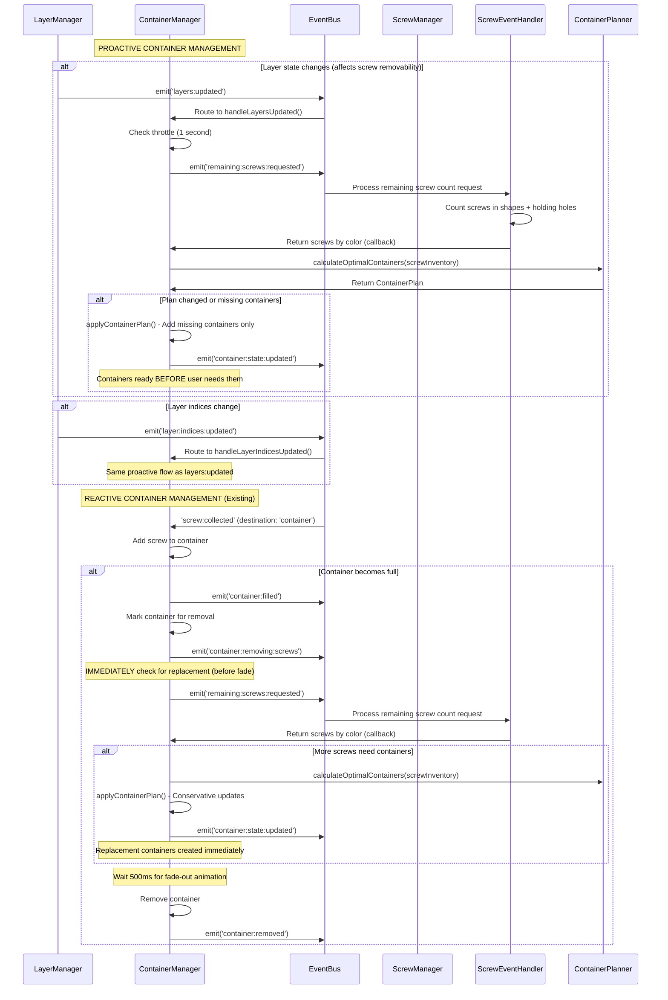

# Game Event Flows Documentation

## Documentation Guidelines

**Note**: This document does not maintain statistics on emission/subscription counts. These change frequently and are not essential for understanding the event architecture.

**Note**: This document is a companion to the `game_architecture.md` document, which details the overall game architecture and logic flows. This document focuses specifically on the event-driven architecture and event flows within the game.

**Updates**: Changes should be integrated directly into existing sections rather than added to a separate "updates" section. Only add new sections when entirely new systems are introduced.

## Overview

The game event system provides a comprehensive, type-safe event-driven architecture for the 2D physics puzzle game. It follows a clean separation of concerns with a shared foundation that both game and editor extend.

## Architecture

### Core Components

1. **SharedEventBus** (`src/shared/events/SharedEventBus.ts`)
   - Core event bus with priority handling, loop detection, and performance tracking
   - Supports both synchronous and asynchronous event processing
   - Provides comprehensive debugging and monitoring capabilities

2. **BaseEventTypes** (`src/shared/events/BaseEventTypes.ts`)
   - Common event interfaces used by both game and editor
   - Includes physics, shape lifecycle, validation, file operations, and system events

3. **Game EventBus** (`src/game/events/EventBus.ts`)
   - Singleton extending SharedEventBus with game-specific configuration
   - Namespace: 'game'
   - Max history: 1000 events, Loop detection threshold: 50

4. **Game EventTypes** (`src/game/events/EventTypes.ts`)
   - 120+ game-specific event definitions
   - Comprehensive type safety with union types

## Event Categories

### Game Lifecycle Events
- **Game State**: `game:started`, `game:paused`, `game:resumed`, `game:over`
- **Level Management**: `level:started`, `level:complete`, `level:progress:updated`
- **System Coordination**: `system:ready`, `all_layers:cleared`

### Screw System Events (Core Gameplay)
- **User Interactions**: `screw:clicked`, `screw:blocked:clicked`
- **State Changes**: `screw:removed`, `screw:collected`, `screw:blocked`, `screw:unblocked`
- **Animations**: `screw:animation:started`, `screw:animation:completed`
- **Transfers**: `screw:transfer:started`, `screw:transfer:completed`, `screw:transfer:failed`
- **Ownership**: Immediate ownership transfer when operations begin (not when animations complete)
- **Generation**: `screws:generated`, `shape:screws:ready`
- **Counting**: `remaining:screws:requested` - Counts screws in shapes AND holding holes

### Shape System Events
- **Lifecycle**: `shape:created`, `shape:destroyed`, `shape:fell_off_screen`
- **Physics**: `shape:physics:updated`, `shape:attachment:changed`

### Layer System Events
- **Management**: `layer:created`, `layer:cleared`, `layer:visibility:changed`
- **State**: `layers:updated`, `layer:bounds:changed`, `layer:indices:updated`
- **Readiness**: `layer:shapes:ready`, `all_layers:screws:ready`
- **Layer Clearing**: `all:layers:cleared` - **Note**: Visual state only, NOT level completion

### Container System Events
- **State Changes**: `container:filled`, `container:replaced`, `container:all_removed`
- **Progress**: `container:progress:updated`, `container:state:updated`
- **Colors**: `container:colors:updated`
- **Lifecycle**: `container:initialize`, `container:removing:screws`
- **Transfers**: `screw:transfer:completed`, `screw:transfer:failed`, `screw:transfer:color_check`

### Physics Events
- **Bodies**: `physics:body:added`, `physics:body:removed`, `physics:body:removed:immediate`
- **Constraints**: `physics:constraint:added`, `physics:constraint:removed`
- **Collisions**: `physics:collision:detected`
- **Simulation**: `physics:step:completed`, `physics:dormant:layers:set`

### Persistence Events
- **Save/Load**: `save:requested`, `save:completed`, `restore:requested`, `restore:completed`
- **State**: `save:state:changed`

## Event Emitters and Subscribers Matrix

### Major Event Emitters

| System | Primary Events Emitted |
|--------|------------------------|
| **ContainerManager** | `container:filled`, `container:state:updated`, `container:colors:updated`, `container:replaced`, `container:all_removed`, `container:removing:screws` |
| **HoldingHoleManager** | `holding_hole:filled`, `holding_hole:state:updated`, `holding_holes:full`, `holding_holes:available` |
| **ScrewManager** | `screw:collected`, `screw:removed`, `screw:animation:*`, `screw:transfer:*` |
| **GameStateCore** | Game state transitions, progress tracking events |
| **SaveLoadManager** | `save:completed`, `restore:completed`, error events |
| **PhysicsWorld** | `physics:body:*`, `physics:constraint:*`, `physics:collision:detected` |

### Major Event Subscribers

| System | Primary Events Subscribed |
|--------|---------------------------|
| **GameEventCoordinator** | `game:started`, `game:over`, `level:complete`, `debug:*`, `score:*`, `progress:updated`, `holding_hole:filled`, `container:filled` |
| **ContainerManager** | `container:filled`, `container:initialize`, `screw:transfer:*`, `screw:collected`, `bounds:changed`, `layers:updated`, `layer:indices:updated` |
| **GameRenderManager** | Render-related events, bounds changes |
| **GameDebugManager** | `debug:mode:toggled`, `debug:info:requested` |
| **SaveLoadManager** | `save:requested`, `restore:requested` |

## Critical Event Flows

### 1. Screw Removal Flow (with Ownership Transfer)

### 2. Container Management Flow (Proactive + Reactive)

### 3. Level Progression Flow

### 4. Physics Integration Flow

### 5. Remaining Screw Counting Flow

The `remaining:screws:requested` event is critical for container replacement logic and win condition checking. It ensures accurate screw counting across all game states.

**Key Implementation Details:**
- **ScrewEventHandler.handleRemainingScrewCountsRequested()** processes the request
- **Counts screws in shapes**: Iterates through `state.screws` filtering for active screws
- **Counts screws in holding holes**: Iterates through `state.holdingHoles` checking for occupied holes
- **Returns color-mapped counts**: Uses callback pattern with `Map<string, number>`
- **Used by ContainerManager**: For intelligent container replacement decisions  
- **Used by ProgressTracker**: For accurate win condition detection

### 6. Ownership Transfer and Disposal Safety Flow

The ownership system ensures data integrity during shape destruction and layer clearing:

**Ownership Benefits:**
- **Race Condition Prevention**: Clear ownership eliminates complex cleanup checks
- **Data Integrity**: Screws cannot be deleted by unauthorized systems
- **Simplified Logic**: No need to check containers/holding holes during disposal
- **Debug Visibility**: Complete ownership tracking with logging

## Event Naming Conventions

### Established Patterns

1. **Domain-Action Structure**: `domain:action` or `domain:subdomain:action`
   -  `screw:clicked`, `container:filled`, `level:complete`
   -  `physics:body:added`, `screw:animation:started`

2. **State Update Events**: Use `:updated` suffix
   -  `container:state:updated`, `layer:bounds:changed`

3. **Request-Response Patterns**: Use `:requested` for requests
   -  `save:requested`, `restore:requested`

### Naming Convention Fixes Applied

**Fixed Inconsistent Separator Usage** (✅ Completed):
- `level_score:updated` → `level:score:updated`
- `total_score:updated` → `total:score:updated` 
- `game_state:request` → `game:state:request`
- `container_state:request` → `container:state:request`
- `holding_hole_state:request` → `holding:hole:state:request`
- `game_state:restore` → `game:state:restore`
- `container_state:restore` → `container:state:restore`
- `holding_hole_state:restore` → `holding:hole:state:restore`

**Standardized Pattern**: All events now follow consistent `domain:action` or `domain:subdomain:action` format with colon separators.

## System Reliability Improvements

### Critical Race Condition Fixes (✅ Completed)

#### **Container Replacement Race Condition**
**Issue**: Container replacement used `setTimeout()` which created race conditions where containers could be removed or indices could change during the 500ms delay.

**Solution**: Moved replacement logic to the animation update cycle in `ContainerManager.updateContainerAnimations()`. Replacement now triggers when fade-out animation completes, eliminating timing-based race conditions.

**Files Modified**:
- `src/game/core/managers/ContainerManager.ts` - Added `containersBeingProcessed` Set for duplicate prevention
- Replaced `setTimeout()` with event-driven animation completion handling

#### **Physics Constraint Race Condition**
**Issue**: Physics constraints were removed immediately when screw collection started, but screw state (`isBeingCollected`) wasn't set until later, creating a window for duplicate clicks.

**Solution**: Made screw collection atomic by moving physics constraint removal inside the state-setting operation.

**Files Modified**:
- `src/game/systems/ScrewManager.ts` - Modified `startScrewCollection()` to handle physics atomically
- `src/game/systems/screw/ScrewEventHandler.ts` - Added validation to prevent duplicate clicks

#### **State Validation Improvements**
**Issue**: Missing validation allowed operations on invalid states (e.g., placing screws in occupied holes).

**Solution**: Added comprehensive validation throughout the codebase:
- Container state validation before operations
- Screw state validation to prevent race conditions
- Hole availability validation before placement

#### **Screw Physics State Management Race Condition**
**Issue**: Physics service was not properly accounting for screws in containers (`isInContainer` state) when determining if shapes should become dynamic. This caused shapes to remain static even when they logically had only 1 active screw left.

**Root Cause**: Screws have multiple states:
- `isBeingCollected` (during animation)
- `isInContainer` (placed in container but not truly collected) 
- `isCollected` (when container is removed)

The physics service was only filtering out `isCollected` and `isBeingCollected` screws, missing `isInContainer` screws.

**Solution**: Updated all screw filtering logic to exclude `isInContainer` screws:
- `removeConstraintOnly()`: Fixed screw counting for physics state decisions
- `updateShapeConstraints()`: Fixed single-screw constraint recreation  
- `checkForStuckShapes()`: Fixed stuck shape detection
- `handleScrewClicked()`: Fixed duplicate click prevention

**Files Modified**:
- `src/game/systems/screw/ScrewPhysicsService.ts` - Updated constraint logic and stiffness for single-screw scenarios
- `src/game/systems/ScrewManager.ts` - Updated screw state filtering
- `src/shared/physics/PhysicsBodyFactory.ts` - Improved constraint creation for dynamic shapes

#### **Physics Constraint Stiffness Optimization**
**Issue**: When shapes had only 1 screw left, constraint recreation was using very high stiffness (0.95) for composite bodies which prevented natural movement around the pivot point.

**Solution**: 
- Use lower stiffness (0.7 for composite, 0.8 for regular) in single-screw constraints
- Allow custom stiffness options to override default composite body logic  
- Enhanced physics nudges for partially dynamic shapes with both angular and linear components
- More effective nudging for composite bodies vs regular shapes

This allows shapes with 1 screw to move naturally around their pivot point while still being properly constrained.

### Shared Utilities Framework (✅ Completed)

Created comprehensive shared utilities to eliminate code duplication and ensure consistency:

#### **EventEmissionUtils** (`src/shared/utils/EventEmissionUtils.ts`)
- Standardized event creation with automatic timestamps
- Consistent completion event patterns
- Eliminates duplicate event emission code

#### **StateValidationUtils** (`src/shared/utils/StateValidationUtils.ts`)
- Unified validation patterns for systems, game state, screws, and containers
- Atomic validation operations with clear error reporting
- Prevents invalid state transitions

#### **DebugLogger** (`src/shared/utils/DebugLogger.ts`)
- Consistent debug logging across all systems
- Conditional logging based on debug flags
- Standardized log formatting with emojis for easy identification

### Proactive Container Management System (✅ Completed)

#### **Container Planning System**
**Problem**: Containers were only created reactively after filled containers were removed, causing delays where users had removable screws of multiple colors but insufficient containers.

**Solution**: Implemented proactive container management using `ContainerPlanner` utility and event-driven updates.

**Key Components**:

#### **ContainerPlanner** (`src/game/utils/ContainerPlanner.ts`)
- Pure function utility for optimal container calculation
- `calculateOptimalContainers()`: Takes screw inventory, returns optimal container plan
- `plansEqual()`: Efficiently compares container plans to prevent unnecessary updates
- Conservative approach: Only adds missing containers, never replaces existing ones with screws

#### **Proactive Event Triggers**
The container system now listens to events that indicate screw availability changes:
- `layers:updated` - When layer visibility changes (affects screw removability)
- `layer:indices:updated` - When layer ordering changes (affects screw accessibility)  
- `screw:collected` - When screws are placed in containers (changes inventory needs)

#### **Throttled Updates**
- 1-second throttle prevents excessive recalculations during rapid state changes
- `proactivelyUpdateContainers()` method handles throttling logic
- Debug logging shows throttling decisions for troubleshooting

#### **Conservative Container Updates**
- `applyContainerPlan()` with `clearExisting=false` only adds missing containers
- Never removes containers that have screws in them
- Maintains existing container positions and states
- Only creates containers for colors that don't have containers yet

**Files Modified**:
- `src/game/core/managers/ContainerManager.ts` - Added proactive event handlers and throttling
- `src/game/utils/ContainerPlanner.ts` - New pure function utility for container planning

#### **Container Replacement Timing Fix**
**Problem**: Container replacement calculations were happening after the 500ms fade animation completed, creating a race condition where screws could be placed in holding holes during the fade delay, causing replacement containers to not be created.

**Solution**: Move replacement calculation to happen **immediately** when container is marked for removal, before the fade animation starts.

**Timing Flow**:
1. Container filled → Mark for removal → **IMMEDIATELY calculate replacements**
2. Start fade animation (500ms)
3. Replacement containers created during fade
4. Original container physically removed after fade completes

**Benefits**:
- Containers are ready BEFORE users need them, not after
- Eliminates reactive delays in container creation
- Maintains performance through intelligent throttling
- Conservative approach prevents unwanted container changes
- **Prevents race conditions during fade animations**

## Performance Considerations

### Event Loop Detection
- Sophisticated loop detection with contextual keys
- Prevents infinite event chains during rapid state changes
- Maximum loop count: 50 per unique context

### High-Frequency Events
- `physics:step:completed` - Every physics frame
- `screw:animation:*` - During animations
- `progress:updated` - During active gameplay

### Memory Management
- Event history limited to 1000 entries
- Automatic cleanup of one-time subscriptions
- Performance metrics tracked for all event processing

## Debugging and Monitoring

### Available Tools
1. **Event History**: Last 1000 events with timing data
2. **Performance Stats**: Handler counts, average durations, error counts
3. **Subscription Debugging**: View all active subscriptions by event type
4. **Loop Detection**: Automatic detection and logging of event loops

### Debug Event Types
- `debug:mode:toggled` - Enable/disable debug features
- `debug:info:requested` - Request system state information
- `debug:performance:test` - Run performance tests

## Error Handling

### Error Event Types
- `system:error` - General system errors
- `physics:error` - Physics simulation errors  
- `save:error` - Save/load operation errors

### Error Recovery Patterns
- Graceful degradation for non-critical errors
- Automatic retry mechanisms for transient failures
- Event bus isolation prevents cascading failures

## Best Practices

1. **Event Naming**: Use consistent colon separators and domain-action structure
2. **Error Handling**: Always emit error events for failure cases
3. **State Consistency**: Use request-response patterns for state queries
4. **Performance**: Batch related events when possible
5. **Debugging**: Include contextual information in event payloads
6. **Type Safety**: Always use typed event interfaces

## Future Improvements

1. **Naming Standardization**: Fix underscore vs colon inconsistencies
2. **Event Batching**: Implement batching for high-frequency events
3. **Performance Monitoring**: Add automatic performance threshold alerts
4. **Event Replay**: Add event replay capabilities for debugging