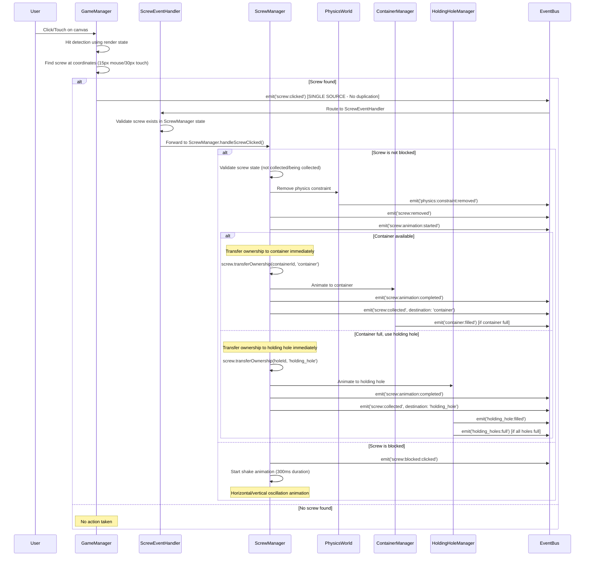
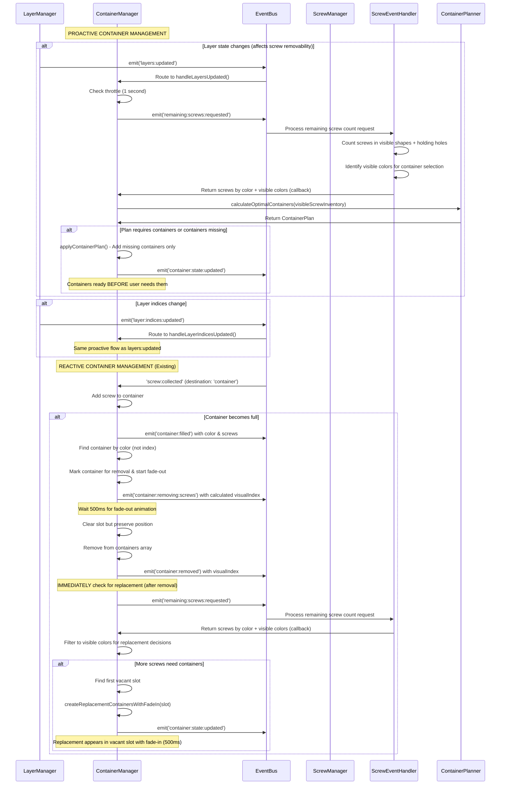

# Game Event Flows Documentation

## Documentation Guidelines

**Note**: This document does not maintain statistics on emission/subscription counts. These change frequently and are not essential for understanding the event architecture.

**Note**: This document is a companion to the `game_architecture.md` document, which details the overall game architecture and logic flows. This document focuses specifically on the event-driven architecture and event flows within the game.

**Maintenance**: This document describes the current state of the event architecture. New functionality is documented directly in relevant sections rather than as separate updates.

## Overview

The game event system provides a comprehensive, type-safe event-driven architecture for the 2D physics puzzle game. It follows a clean separation of concerns with a shared foundation that both game and editor extend.

### Event Naming Convention Standardization

All events follow a consistent `domain:action` or `domain:subdomain:action` format with colon separators for predictable hierarchy and industry alignment. Standard event naming patterns include:
- `level:score:updated` for level score updates
- `game:state:request` for game state requests
- `container:state:request` for container state requests

This standardization provides consistent, predictable event names and easier understanding of event hierarchy. **Note**: Some events may still use underscores in legacy systems during the transition to the colon format.

## Architecture

### Core Components

1. **SharedEventBus** (`src/shared/events/SharedEventBus.ts`)
   - Core event bus with priority handling, loop detection, and performance tracking
   - **Key Features**:
     - Priority-based event processing for critical operations
     - Loop detection with contextual keys (threshold: 50) prevents infinite chains
     - Performance monitoring and metrics built-in
     - Comprehensive debugging capabilities
     - Event history tracking (limited to 1000 entries for memory management)
   - **Benefits**: Eliminated code duplication, consistent event handling, better debugging
   - Supports both synchronous and asynchronous event processing
   - Provides comprehensive debugging and monitoring capabilities

2. **BaseEventTypes** (`src/shared/events/BaseEventTypes.ts`)
   - Common event interfaces used by both game and editor
   - Includes physics, shape lifecycle, validation, file operations, and system events

3. **Game EventBus** (`src/game/events/EventBus.ts`)
   - Singleton extending SharedEventBus with game-specific configuration
   - Namespace: 'game'
   - Max history: 1000 events, Loop detection threshold: 50

4. **Game EventTypes** (`src/game/events/EventTypes.ts`)
   - 120+ game-specific event definitions
   - Comprehensive type safety with union types
   - **Race condition protection**: Single event handlers prevent duplicate processing (e.g., `next:level:requested` is handled exclusively by `GameEventCoordinator`)

## Event Categories

### Game Lifecycle Events
- **Game State**: `game:started`, `game:paused`, `game:resumed`, `game:over`
- **Level Management**: `level:started`, `level:win:condition:met`, `level:transition:completed`, `level:progress:updated`, `next:level:requested`
- **System Coordination**: `system:ready`, `all:layers:cleared`

### Screw System Events (Core Gameplay)
- **User Interactions**: `screw:clicked` (single-source emission from GameManager only), `screw:blocked:clicked` (with race condition protection)
- **State Changes**: `screw:removed`, `screw:collected`, `screw:blocked`, `screw:unblocked`
- **Animations**: `screw:animation:started`, `screw:animation:completed`
- **Transfers**: `screw:transfer:started`, `screw:transfer:completed`, `screw:transfer:failed`
- **Ownership**: Immediate ownership transfer when operations begin (not when animations complete) - prevents race conditions during shape destruction
- **Generation**: `screws:generated`, `shape:screws:ready`
- **Counting**: `remaining:screws:requested` - Counts screws in visible shapes and holding holes for container planning, with hole sizing based on ALL screws of selected colors
- **Physics Integration**: Enhanced physics constraint management with proper `isInContainer` state handling

### Shape System Events
- **Lifecycle**: `shape:created`, `shape:destroyed`, `shape:fell_off_screen`
- **Physics**: `shape:physics:updated`, `shape:attachment:changed`

### Layer System Events
- **Management**: `layer:created`, `layer:cleared`, `layer:visibility:changed`
- **State**: `layers:updated`, `layer:bounds:changed`, `layer:indices:updated`
- **Readiness**: `layer:shapes:ready`, `all_layers:screws:ready`
- **Layer Clearing**: `all:layers:cleared` - **Note**: Visual state only, NOT level completion

### Container System Events
- **State Changes**: `container:filled`, `container:replaced`, `container:all_removed`
- **Progress**: `container:progress:updated`, `container:state:updated`
- **Colors**: `container:colors:updated`
- **Lifecycle**: `container:initialize`, `container:removing:screws`
- **Transfers**: `screw:transfer:completed`, `screw:transfer:failed`, `screw:transfer:color_check`
- **Positioning**: Fixed 4-slot system prevents container shifting on removal
- **Hole Planning**: Container holes sized based on ALL remaining screws of visible colors (1-3 holes max), ensuring proper capacity for future collection
- **Proactive Management**: Containers created before needed via `layers:updated` and `layer:indices:updated` triggers
- **Replacement Timing**: Fixed race conditions by moving replacement logic to animation completion cycle

### Physics Events
- **Bodies**: `physics:body:added`, `physics:body:removed`, `physics:body:removed:immediate`
- **Constraints**: `physics:constraint:added`, `physics:constraint:removed`
- **Collisions**: `physics:collision:detected`
- **Simulation**: `physics:step:completed`, `physics:dormant:layers:set`

### Persistence Events
- **Save/Load**: `save:requested`, `save:completed`, `restore:requested`, `restore:completed`
- **State**: `save:state:changed`

## Event Emitters and Subscribers Matrix

### Major Event Emitters

| System | Primary Events Emitted |
|--------|------------------------|
| **GameManager** | `game:started`, `game:paused`, `game:resumed`, `game:over`, `level:started`, `screw:clicked` (single-source input) |
| **ContainerManager** | `container:filled`, `container:state:updated`, `container:colors:updated`, `container:replaced`, `container:all_removed`, `container:removing:screws` |
| **HoldingHoleManager** | `holding_hole:filled`, `holding_hole:state:updated`, `holding_holes:full`, `holding_holes:available` |
| **ScrewManager** | `screw:collected`, `screw:removed`, `screw:animation:*`, `screw:transfer:*` |
| **GameStateCore** | `level:transition:completed`, game state transitions, progress tracking events |
| **ProgressTracker** | `level:win:condition:met`, `progress:updated`, progress tracking events |
| **SaveLoadManager** | `save:completed`, `restore:completed`, error events |
| **PhysicsWorld** | `physics:body:*`, `physics:constraint:*`, `physics:collision:detected` |

### Major Event Subscribers

| System | Primary Events Subscribed |
|--------|---------------------------|
| **GameEventCoordinator** | `game:started`, `game:over`, `level:complete`, `debug:*`, `score:*`, `progress:updated`, `holding_hole:filled`, `container:filled` |
| **ContainerManager** | `container:filled`, `container:initialize`, `screw:transfer:*`, `screw:collected`, `bounds:changed`, `layers:updated`, `layer:indices:updated` |
| **GameRenderManager** | Render-related events, bounds changes |
| **GameDebugManager** | `debug:mode:toggled`, `debug:info:requested` |
| **SaveLoadManager** | `save:requested`, `restore:requested` |

## Input Handling Event Architecture

### Single-Source Input Pattern

The game implements a **single-source input handling pattern** to ensure reliable event emission and prevent animation conflicts:

#### **Event Source Hierarchy**
- **Primary Source**: GameManager exclusively handles all canvas input events
- **Event Emission**: Only GameManager emits `screw:clicked` events
- **No Duplication**: React component (GameCanvas) does not handle click events

#### **Input Processing Flow**
1. **Native Event Capture**: GameManager adds `addEventListener` to canvas for click/touch
2. **Hit Detection**: Uses GameRenderManager.getRenderState().allScrews for coordinate testing
3. **State Validation**: ScrewEventHandler validates screw exists in ScrewManager.state.screws
4. **Single Emission**: One `screw:clicked` event per user interaction

#### **Historical Issue Resolution**

**Previous Architecture Problem**:
- Both GameManager and GameCanvas handled the same canvas events
- Resulted in duplicate `screw:clicked` events for every interaction
- Caused interference with shake animations and collection behaviors

**Current Solution**:
- GameManager: Exclusive input event handler using native addEventListener
- GameCanvas: React component provides canvas but no event handling
- Result: Single event emission, reliable animations, predictable behavior

#### **Cross-Platform Input Support**
- **Mouse Events**: 15px interaction radius for precise desktop targeting
- **Touch Events**: 30px interaction radius for comfortable mobile interaction
- **Debug Features**: Shift+click for force removal, bypass mechanisms
- **Event Prevention**: Touch events prevent default zoom/scroll behaviors

## Critical Event Flows

### 1. Screw Removal Flow (Single-Source Input Handling)

### 2. Container Management Flow (Proactive + Reactive)

**Features proactive management with race condition protection:**

### 3. Level Progression Flow

**Properly coordinated through GameEventCoordinator to prevent duplicate processing:**

### 4. Physics Integration Flow

**Features atomic screw state management and constraint handling:**

### 5. Remaining Screw Counting Flow

The `remaining:screws:requested` event is critical for container replacement logic and win condition checking. It provides both screw counts and visible color information for accurate container planning.

**Key Implementation Details:**
- **ScrewEventHandler.handleRemainingScrewCountsRequested()** processes the request
- **Counts screws in visible shapes**: Iterates through `state.screws` filtering for active screws in visible layers
- **Counts screws in holding holes**: Iterates through `state.holdingHoles` checking for occupied holes
- **Identifies visible colors**: Tracks colors present in visible shapes and holding holes for container selection
- **Returns dual data**: Uses callback pattern with `Map<string, number>` + `Set<string>` for counts and visible colors
- **Used by ContainerManager**: For intelligent container replacement decisions using visible colors only
- **Used by ProgressTracker**: For accurate win condition detection based on visible layer progress

### 6. Ownership Transfer and Disposal Safety Flow

The ownership system ensures data integrity during shape destruction and layer clearing:

**Ownership Benefits:**
- **Race Condition Prevention**: Clear ownership eliminates complex cleanup checks
- **Data Integrity**: Screws cannot be deleted by unauthorized systems (via `canBeDeletedBy()` validation)
- **Simplified Logic**: No need to check containers/holding holes during disposal
- **Debug Visibility**: Complete ownership tracking with logging
- **State Integrity**: Proper handling of `isInContainer`, `isBeingCollected`, and `isCollected` states

## Event Naming Conventions

### Established Patterns

1. **Domain-Action Structure**: `domain:action` or `domain:subdomain:action`
   -  `screw:clicked`, `container:filled`, `level:complete`
   -  `physics:body:added`, `screw:animation:started`

2. **State Update Events**: Use `:updated` suffix
   -  `container:state:updated`, `layer:bounds:changed`

3. **Request-Response Patterns**: Use `:requested` for requests
   -  `save:requested`, `restore:requested`

### Event Naming Consistency

All events follow a consistent `domain:action` or `domain:subdomain:action` format with colon separators for predictable hierarchy and industry alignment. This standardization provides consistent, predictable event names and easier understanding of event hierarchy.

## Performance Considerations

### Event Loop Detection
- Sophisticated loop detection with contextual keys
- Prevents infinite event chains during rapid state changes
- Maximum loop count: 50 per unique context

### High-Frequency Events
- `physics:step:completed` - Every physics frame
- `screw:animation:*` - During animations
- `progress:updated` - During active gameplay

### Memory Management
- Event history limited to 1000 entries
- Automatic cleanup of one-time subscriptions
- Performance metrics tracked for all event processing

## Debugging and Monitoring

### Available Tools
1. **Event History**: Last 1000 events with timing data
2. **Performance Stats**: Handler counts, average durations, error counts
3. **Subscription Debugging**: View all active subscriptions by event type
4. **Loop Detection**: Automatic detection and logging of event loops

### Debug Event Types
- `debug:mode:toggled` - Enable/disable debug features
- `debug:info:requested` - Request system state information
- `debug:performance:test` - Run performance tests

## Error Handling

### Error Event Types
- `system:error` - General system errors
- `physics:error` - Physics simulation errors  
- `save:error` - Save/load operation errors

### Error Recovery Patterns
- Graceful degradation for non-critical errors
- Automatic retry mechanisms for transient failures
- Event bus isolation prevents cascading failures

## Best Practices

1. **Event Naming**: Use consistent colon separators and domain-action structure
2. **Error Handling**: Always emit error events for failure cases
3. **State Consistency**: Use request-response patterns for state queries
4. **Performance**: Batch related events when possible
5. **Debugging**: Include contextual information in event payloads
6. **Type Safety**: Always use typed event interfaces

## Future Improvements

1. **Naming Standardization**: Complete transition of remaining underscore events to colon format
2. **Event Batching**: Implement batching for high-frequency events
3. **Performance Monitoring**: Add automatic performance threshold alerts
4. **Event Replay**: Add event replay capabilities for debugging
5. **Additional Race Condition Prevention**: Continue monitoring for edge cases in event handling